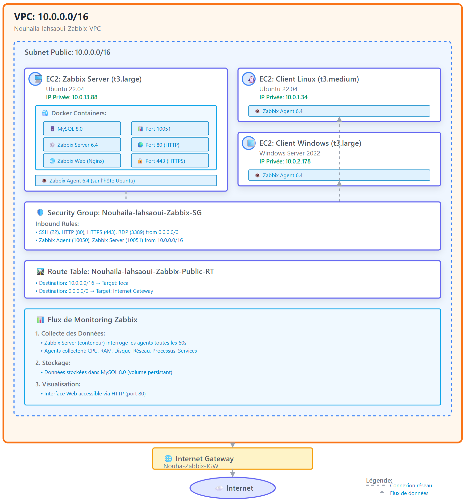
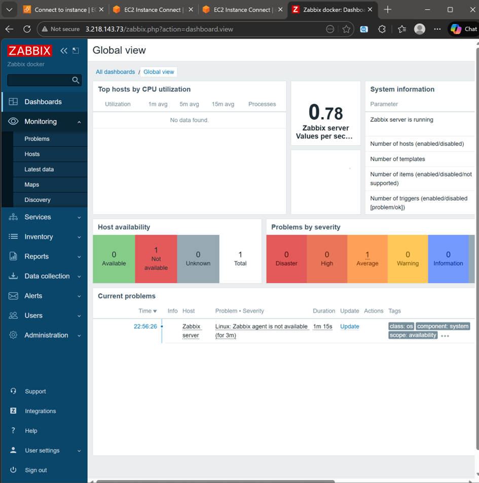
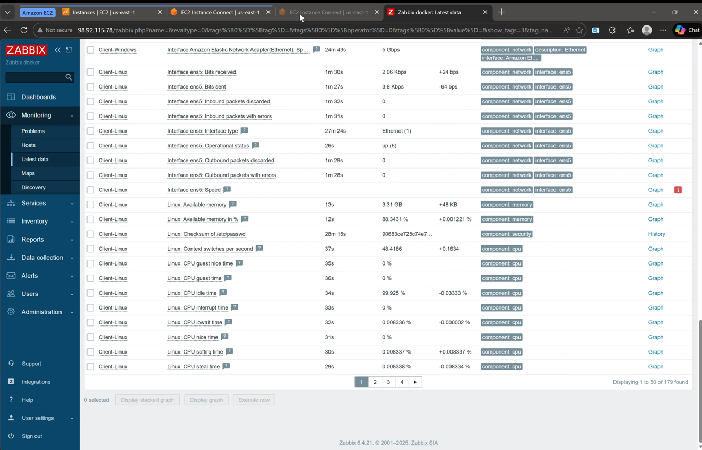

# 🚀 Projet Zabbix sur AWS - Infrastructure de Monitoring Centralisée

## 📋 Description du Projet

Déploiement d'une infrastructure de monitoring centralisée sur AWS utilisant Zabbix conteneurisé avec Docker pour surveiller un parc hybride (Linux & Windows).

**Établissement :** [Votre Établissement]  
**Étudiant :** Nouhaila Lahsaoui  
**Encadrant :** Prof. Azeddine KHIAT  
**Année Universitaire :** 2025/2026  
**Date :** Décembre 2025

---

## 🏗️ Architecture du Projet

### Infrastructure AWS



### Composants Réseau

- **VPC :** `10.0.0.0/16`
- **Subnet Public :** `10.0.0.0/16`
- **Internet Gateway :** Attachée au VPC
- **Route Table :** Route `0.0.0.0/0` → IGW
- **Security Group :**
  - **Inbound :** SSH (22), HTTP (80), HTTPS (443), RDP (3389), Zabbix Agent (10050), Zabbix Server (10051)
  - **Outbound :** All traffic

---

## 🐳 Configuration Docker Compose

---

## 🛠️ Installation et Déploiement

### 1. Prérequis AWS

- Compte AWS Academy Learner Lab
- Budget disponible (minimum 10$ pour les tests)
- Région : `us-east-1` (N. Virginia)

### 2. Configuration AWS

#### Créer le VPC
```bash
VPC Name: Nouhaila-lahsaoui-Zabbix-VPC
IPv4 CIDR: 10.0.0.0/16
```

#### Créer le Subnet
```bash
Subnet Name: Nouhaila-lahsaoui-Zabbix-Public-Subnet
CIDR: 10.0.0.0/16
Availability Zone: us-east-1a
```

#### Créer et Attacher l'Internet Gateway
```bash
IGW Name: Nouha-Zabbix-IGW
Attach to: Nouhaila-lahsaoui-Zabbix-VPC
```

#### Configurer la Route Table
```bash
Route Table Name: Nouhaila-lahsaoui-Zabbix-Public-RT
Routes:
  - Destination: 0.0.0.0/0 → Target: Internet Gateway
Subnet Associations:
  - Nouhaila-lahsaoui-Zabbix-Public-Subnet
```

#### Créer le Security Group
```bash
Security Group Name: Nouhaila-lahsaoui-Zabbix-SG

Inbound Rules:
  - SSH (22) from 0.0.0.0/0
  - HTTP (80) from 0.0.0.0/0
  - HTTPS (443) from 0.0.0.0/0
  - RDP (3389) from 0.0.0.0/0
  - Custom TCP (10050) from 10.0.0.0/16
  - Custom TCP (10051) from 10.0.0.0/16

Outbound Rules:
  - All traffic to 0.0.0.0/0
```

### 3. Déploiement des Instances EC2

#### Instance Serveur Zabbix
```bash
Name: Zabbix-server-Nouhaila-Lahsaoui
AMI: Ubuntu 22.04 LTS
Instance Type: t3.large
Key Pair: Zabbix-key-pair
VPC: Nouhaila-lahsaoui-Zabbix-VPC
Subnet: Nouhaila-lahsaoui-Zabbix-Public-Subnet
Auto-assign Public IP: Enable
Security Group: Nouhaila-lahsaoui-Zabbix-SG
```

#### Instance Client Linux
```bash
Name: Client-Linux
AMI: Ubuntu 22.04 LTS
Instance Type: t3.medium
[Même configuration réseau]
```

#### Instance Client Windows
```bash
Name: Client-Windows
AMI: Windows Server 2022
Instance Type: t3.large
[Même configuration réseau]
```

### 4. Installation Docker sur le Serveur Zabbix

```bash
# Se connecter au serveur
ssh -i "Zabbix-key-pair.pem" ubuntu@<IP_PUBLIQUE_SERVEUR>

# Mettre à jour le système
sudo apt update && sudo apt upgrade -y

# Installer Docker
sudo apt install docker.io -y
sudo systemctl start docker
sudo systemctl enable docker

# Installer Docker Compose
sudo apt install docker-compose -y

# Ajouter l'utilisateur au groupe docker
sudo usermod -aG docker ubuntu
```

### 5. Déployer Zabbix avec Docker Compose

```bash
# Créer le répertoire du projet
mkdir ~/zabbix-docker
cd ~/zabbix-docker

# Créer le fichier docker-compose.yml
nano docker-compose.yml
# [Copier le contenu du docker-compose.yml ci-dessus]

# Démarrer les conteneurs
sudo docker-compose up -d

# Vérifier l'état des conteneurs
sudo docker-compose ps

# Surveiller les logs (attendre 5-7 minutes pour l'initialisation)
sudo docker-compose logs -f zabbix-server
```

### 6. Accéder à l'Interface Web Zabbix

```
URL: http://<IP_PUBLIQUE_SERVEUR>
Username: Admin
Password: zabbix
```

### 7. Installation des Agents Zabbix

#### Sur le Serveur Zabbix (Ubuntu)

```bash
# Télécharger et installer le dépôt Zabbix
wget https://repo.zabbix.com/zabbix/6.4/ubuntu/pool/main/z/zabbix-release/zabbix-release_6.4-1+ubuntu22.04_all.deb
sudo dpkg -i zabbix-release_6.4-1+ubuntu22.04_all.deb
sudo apt update

# Installer l'agent
sudo apt install zabbix-agent -y

# Configurer l'agent
sudo nano /etc/zabbix/zabbix_agentd.conf
```

**Configuration :**
```bash
PidFile=/run/zabbix/zabbix_agentd.pid
LogFile=/var/log/zabbix/zabbix_agentd.log
LogFileSize=0
Server=10.0.13.88
ServerActive=10.0.13.88
Hostname=Zabbix server
ListenIP=0.0.0.0
ListenPort=10050
```

```bash
# Créer les répertoires nécessaires
sudo mkdir -p /var/log/zabbix /run/zabbix
sudo chown -R zabbix:zabbix /var/log/zabbix /run/zabbix

# Démarrer l'agent
sudo systemctl restart zabbix-agent
sudo systemctl enable zabbix-agent
sudo systemctl status zabbix-agent

# Tester
sudo docker exec zabbix-server zabbix_get -s 10.0.13.88 -k agent.ping
```

#### Sur le Client Linux (Ubuntu)

```bash
# Se connecter au client
ssh -i "Zabbix-key-pair.pem" ubuntu@<IP_PUBLIQUE_CLIENT_LINUX>

# Même procédure d'installation
[Répéter les commandes ci-dessus]
```

**Configuration :**
```bash
PidFile=/run/zabbix/zabbix_agentd.pid
LogFile=/var/log/zabbix/zabbix_agentd.log
LogFileSize=0
Server=10.0.13.88
ServerActive=10.0.13.88
Hostname=Client-Linux
ListenIP=0.0.0.0
ListenPort=10050
```

#### Sur le Client Windows

1. **Télécharger l'agent Zabbix :**
   - URL : https://www.zabbix.com/download_agents
   - Version : Windows (amd64), Agent 6.4

2. **Installer l'agent :**
   - Extraire dans `C:\Zabbix`

3. **Configurer :**
   ```
   C:\Zabbix\conf\zabbix_agentd.conf
   ```
   
   ```ini
   Server=10.0.13.88
   ServerActive=10.0.13.88
   Hostname=Client-Windows
   ```

4. **Installer et démarrer le service :**
   ```powershell
   # PowerShell en Administrateur
   cd C:\Zabbix\bin
   .\zabbix_agentd.exe --config C:\Zabbix\conf\zabbix_agentd.conf --install
   Start-Service "Zabbix Agent"
   Get-Service "Zabbix Agent"
   ```

### 8. Configuration dans Zabbix Web

#### Ajouter les Hôtes

**Pour Client-Linux :**
1. Configuration → Hosts → Create host
2. Host name : `Client-Linux`
3. Groups : `Linux servers`
4. Interfaces → Add → Agent
   - IP address : `10.0.1.34`
   - Port : `10050`
5. Templates → Select → `Linux by Zabbix agent`
6. Update

**Pour Client-Windows :**
1. Configuration → Hosts → Create host
2. Host name : `Client-Windows`
3. Groups : `Windows servers`
4. Interfaces → Add → Agent
   - IP address : `10.0.2.178`
   - Port : `10050`
5. Templates → Select → `Windows by Zabbix agent`
6. Update

**Pour Zabbix server :**
1. Configuration → Hosts → Zabbix server
2. Vérifier/Modifier l'interface :
   - IP address : `10.0.13.88`
   - Port : `10050`

---

## ⚠️ Problèmes Rencontrés et Solutions

### Problème 1 : Impossibilité de se connecter en SSH aux instances

**Symptôme :**
```
ssh -i "Zabbix-key-pair.pem" ubuntu@3.218.143.73
kex_exchange_identification: read: Connection reset
Connection reset by 3.218.143.73 port 22
```

**Cause :**
- Security Group sans règles Outbound (0 Permission entries)
- Route Table non associée au subnet

**Solution :**
1. Ajouter les règles Outbound au Security Group :
   ```
   Type: All traffic
   Destination: 0.0.0.0/0
   ```

2. Associer la Route Table au subnet :
   ```
   VPC → Route Tables → Select Route Table
   → Subnet Associations → Edit
   → Cocher le subnet → Save
   ```

**Impact :** Critique - Sans ces configurations, aucune communication n'est possible.

---

### Problème 2 : Zabbix Server en boucle de redémarrage (Segmentation fault)

**Symptôme :**
```
zabbix-server_1 | Segmentation fault (core dumped)
zabbix-server_1 | Waiting for MySQL...
```

**Cause :**
- Commande personnalisée incorrecte dans docker-compose.yml
- Utilisation de `mysql` au lieu de `mariadb`

**Solution :**
Supprimer la commande personnalisée et laisser le conteneur utiliser son entrypoint par défaut :

```yaml
# AVANT (INCORRECT)
zabbix-server:
  command: ["sh", "-c", "until mysql -h $DB_SERVER_HOST ..."]

# APRÈS (CORRECT)
zabbix-server:
  image: zabbix/zabbix-server-mysql:alpine-6.4-latest
  environment:
    DB_SERVER_HOST: mysql
    MYSQL_DATABASE: zabbix
    MYSQL_USER: zabbix
    MYSQL_PASSWORD: zabbix_pass_2025
  # Pas de commande personnalisée
```

**Impact :** Critique - Le serveur Zabbix ne démarrait pas.

---

### Problème 3 : Base de données Zabbix non initialisée

**Symptôme :**
```
Database error
* Unable to determine current Zabbix database version: 
  the table "dbversion" was not found.
```

**Cause :**
- Variables d'environnement manquantes ou incorrectes
- Ancien volume Docker avec des données corrompues
- Initialisation interrompue

**Solution :**
1. Nettoyer complètement :
   ```bash
   sudo docker-compose down -v
   sudo docker volume prune -f
   ```

2. S'assurer que toutes les variables sont définies :
   ```yaml
   mysql:
     environment:
       MYSQL_ROOT_PASSWORD: root_pass_2025
       MYSQL_DATABASE: zabbix
       MYSQL_USER: zabbix
       MYSQL_PASSWORD: zabbix_pass_2025
   
   zabbix-server:
     environment:
       MYSQL_ROOT_PASSWORD: root_pass_2025  # Important !
   ```

3. Attendre 5-7 minutes pour l'initialisation complète

4. Vérifier la création des tables :
   ```bash
   sudo docker exec zabbix-mysql mysql -uzabbix -pzabbix_pass_2025 zabbix -e "SHOW TABLES;" | wc -l
   # Résultat attendu : ~170 tables
   ```

**Impact :** Bloquant - L'interface web est inutilisable sans base de données initialisée.

---

### Problème 4 : Communication entre conteneur Docker et agent sur l'hôte

**Symptôme :**
```
zabbix_get [213]: Get value error: cannot connect to [[10.0.13.88]:10050]: 
[111] Connection refused
```

**Cause :**
Le serveur Zabbix dans le conteneur Docker ne peut pas communiquer avec l'agent sur l'hôte via `127.0.0.1`, car cette adresse pointe vers le conteneur lui-même dans son espace réseau isolé.

**Solution :**
Utiliser l'IP privée de l'hôte au lieu de 127.0.0.1 :

```bash
# INCORRECT
Server=127.0.0.1

# CORRECT
Server=10.0.13.88  # IP privée de l'hôte
```

**Explication technique :**
```
┌─────────────────────────────────────┐
│   Machine Ubuntu (10.0.13.88)       │
│                                     │
│  ┌─────────────────────────┐       │
│  │ Conteneur Zabbix Server │       │
│  │ 127.0.0.1 = conteneur   │───X───┼──> Ne peut pas joindre l'hôte
│  └─────────────────────────┘       │
│           │                         │
│           │ via 10.0.13.88          │
│           ↓                         │
│  ┌─────────────────────────┐       │
│  │ Agent Zabbix (hôte)     │       │
│  │ Écoute sur :10050       │       │
│  └─────────────────────────┘       │
└─────────────────────────────────────┘
```

**Impact :** Bloquant - Le serveur ne peut pas monitorer sa propre machine.

---

### Problème 5 : Agent Zabbix sur Client Linux ne démarre pas

**Symptôme :**
```bash
sudo systemctl status zabbix-agent
● zabbix-agent.service - Zabbix Agent
   Active: activating (auto-restart) (Result: exit-code)
```

**Causes multiples :**

#### 5.1 Fichier de configuration mal formaté
```bash
# INCORRECT - Pas de saut de ligne
LogFile=/var/log/zabbix-agent/zabbix_agentd.logServer=10.0.13.88

# CORRECT
LogFile=/var/log/zabbix/zabbix_agentd.log
Server=10.0.13.88
```

#### 5.2 Hostname manquant ou incorrect
```bash
# MANQUANT - L'agent ne sait pas comment s'identifier
Server=10.0.13.88
ServerActive=10.0.13.88

# CORRECT
Server=10.0.13.88
ServerActive=10.0.13.88
Hostname=Client-Linux  # CRITIQUE !
```

#### 5.3 Fichiers Include problématiques
```bash
# Peut causer des erreurs si les fichiers sont mal configurés
Include=/etc/zabbix/zabbix_agentd.conf.d/*.conf

# Solution : Désactiver temporairement
# Include=/etc/zabbix/zabbix_agentd.conf.d/*.conf
```

#### 5.4 Permissions incorrectes
```bash
# Les répertoires doivent exister et appartenir à l'utilisateur zabbix
sudo mkdir -p /var/log/zabbix /run/zabbix
sudo chown -R zabbix:zabbix /var/log/zabbix /run/zabbix
```

**Solution complète :**

1. Recréer le fichier de configuration proprement
2. Vérifier avec `sudo zabbix_agentd -t agent.ping`
3. Redémarrer le service
4. Vérifier les logs : `sudo tail -f /var/log/zabbix/zabbix_agentd.log`

**Impact :** Bloquant - Le client ne peut pas être monitoré.

---

### Problème 6 : Session AWS Learner Lab expirée

**Symptôme :**
```
User: arn:aws:sts::211125347605:assumed-role/voclabs/user4612034=Nouhaila_Lahsaoui 
is not authorized to perform: ec2:DescribeInstances with an explicit deny
```

**Cause :**
- Session AWS Academy Lab expirée (durée limitée à ~4 heures)
- Budget épuisé
- Lab arrêté manuellement

**Solution :**
1. Retourner sur AWS Academy
2. Cliquer sur "Start Lab"
3. Attendre que le voyant devienne vert 🟢
4. Cliquer sur "AWS" pour accéder à la console
5. Redémarrer les instances EC2 (elles seront arrêtées)
6. **Important :** Les IP publiques changent à chaque redémarrage

**Impact :** Bloquant - Impossible d'accéder à AWS.

**Note pour le rapport :**
```
Dans un environnement de production, on utiliserait des Elastic IP 
(adresses IP fixes) pour éviter le changement d'IP à chaque redémarrage.
```

---

### Problème 7 : Multiples fichiers docker-compose

**Symptôme :**
```
WARNING: Found multiple config files with supported names: 
docker-compose.yml, docker-compose.yaml
```

**Cause :**
Deux fichiers de configuration présents dans le même répertoire.

**Solution :**
```bash
# Supprimer le fichier en double
rm docker-compose.yaml
# Garder uniquement docker-compose.yml
```

**Impact :** Mineur - Peut causer de la confusion mais n'empêche pas le fonctionnement.

---

## 📊 Vérifications et Tests

### Vérifier l'état des conteneurs Docker
```bash
sudo docker ps
# Les 3 conteneurs doivent être "Up"
```

### Vérifier la base de données
```bash
sudo docker exec zabbix-mysql mysql -uzabbix -pzabbix_pass_2025 zabbix -e "SELECT * FROM dbversion;"
# Doit retourner la version de la base
```

### Tester la communication avec les agents
```bash
# Depuis le serveur Zabbix
sudo docker exec zabbix-server zabbix_get -s 10.0.13.88 -k agent.ping
sudo docker exec zabbix-server zabbix_get -s 10.0.1.34 -k agent.ping
sudo docker exec zabbix-server zabbix_get -s 10.0.2.178 -k agent.ping
# Tous doivent retourner "1"
```


### Vérifier les statuts dans Zabbix Web
```
Monitoring → Hosts
Tous les hôtes doivent avoir le statut ZBX en vert
```
## 1. Dashboard Principal

## 2. Liste des Hosts

## 3. Latest Data - Métriques Temps Réel


---

## 📸 Captures d'Écran Recommandées

### Architecture AWS
1. VPC créé avec CIDR
2. Subnet public configuré
3. Internet Gateway attachée
4. Route Table avec route vers IGW
5. Security Group avec règles In/Out
6. Les 3 instances EC2 en état "Running"

### Déploiement Zabbix
7. Résultat de `sudo docker ps` montrant les 3 conteneurs
8. Vérification de la base de données (SHOW TABLES)
9. Interface de connexion Zabbix
10. Dashboard après connexion

### Configuration des Agents
11. Installation agent Linux - `systemctl status zabbix-agent`
12. Fichier de configuration Linux - `/etc/zabbix/zabbix_agentd.conf`
13. Installation agent Windows - Service actif
14. Configuration agent Windows

### Monitoring
15. Liste des hôtes avec statut ZBX vert
16. Latest Data montrant les métriques en temps réel
17. Graphique CPU d'un client
18. Graphique RAM/Mémoire
19. Page Problems (vide = infrastructure stable)
20. Dashboard global

---

## 💰 Optimisation des Coûts AWS

### Bonnes Pratiques

1. **Arrêter les instances quand non utilisées :**
   ```bash
   EC2 → Instances → Select All → Instance State → Stop
   ```

2. **Coûts horaires approximatifs :**
   - t3.micro : ~$0.01/h
   - t3.medium : ~$0.04/h
   - t3.large : ~$0.08/h

3. **Budget total (50$) permet environ :**
   - 250 heures avec 3 instances (t3.large + t3.medium + t3.large)
   - ~10 jours en utilisation continue

4. **Surveiller le budget :**
   - Dans AWS Academy, vérifier régulièrement la barre de consommation

---

## 🎓 Compétences Acquises

### Compétences Techniques

- ✅ Déploiement d'infrastructure cloud sur AWS
- ✅ Configuration réseau (VPC, Subnets, IGW, Route Tables, Security Groups)
- ✅ Conteneurisation avec Docker et Docker Compose
- ✅ Administration de bases de données MySQL
- ✅ Installation et configuration de Zabbix
- ✅ Monitoring système (Linux & Windows)
- ✅ Débogage et résolution de problèmes réseau
- ✅ Gestion des agents de monitoring
- ✅ Configuration de pare-feu et règles de sécurité

### Compétences Transversales

- ✅ Documentation technique
- ✅ Diagnostic et résolution de problèmes
- ✅ Gestion de projet
- ✅ Recherche et auto-formation
- ✅ Gestion budgétaire (ressources cloud)

---

## 📚 Ressources Utiles

### Documentation Officielle
- [Zabbix Documentation](https://www.zabbix.com/documentation/current/)
- [Docker Documentation](https://docs.docker.com/)
- [AWS Documentation](https://docs.aws.amazon.com/)

### Guides et Tutoriels
- [Zabbix Docker Installation](https://www.zabbix.com/documentation/current/en/manual/installation/containers)
- [AWS VPC Guide](https://docs.aws.amazon.com/vpc/latest/userguide/)
- [Docker Compose Reference](https://docs.docker.com/compose/compose-file/)

### Dépôts GitHub Similaires
- [zabbix/zabbix-docker](https://github.com/zabbix/zabbix-docker)
- [AWS VPC Examples](https://github.com/aws-samples/aws-vpc-examples)

---

## 🔐 Sécurité

### Bonnes Pratiques Appliquées

1. **Isolation réseau :** Utilisation d'un VPC dédié
2. **Contrôle d'accès :** Security Groups avec règles spécifiques
3. **Authentification :** Paires de clés SSH pour les connexions
4. **Mots de passe :** Mots de passe forts pour MySQL et Zabbix

### Améliorations Possibles (Production)

- Utiliser AWS Secrets Manager pour les mots de passe
- Configurer HTTPS avec certificats SSL/TLS
- Restreindre les IP sources aux adresses connues
- Mettre en place des sauvegardes automatiques
- Utiliser des Elastic IP pour des adresses fixes
- Configurer CloudWatch pour les alertes
- Implémenter un bastion host pour l'accès SSH

---

## 🚀 Évolutions Futures

### Améliorations Techniques

- [ ] Haute disponibilité : Cluster Zabbix avec plusieurs serveurs
- [ ] Automatisation : Terraform pour l'infrastructure as code
- [ ] CI/CD : Pipeline pour le déploiement automatique
- [ ] Monitoring avancé : Intégration avec Grafana
- [ ] Alerting : Configuration d'alertes email/SMS
- [ ] Sauvegardes : Stratégie de backup automatique

### Scalabilité

- [ ] Auto-scaling des agents de monitoring
- [ ] Load balancer pour la haute disponibilité
- [ ] Multi-région pour la redondance géographique
- [ ] Intégration avec d'autres services AWS (CloudWatch, SNS)

 